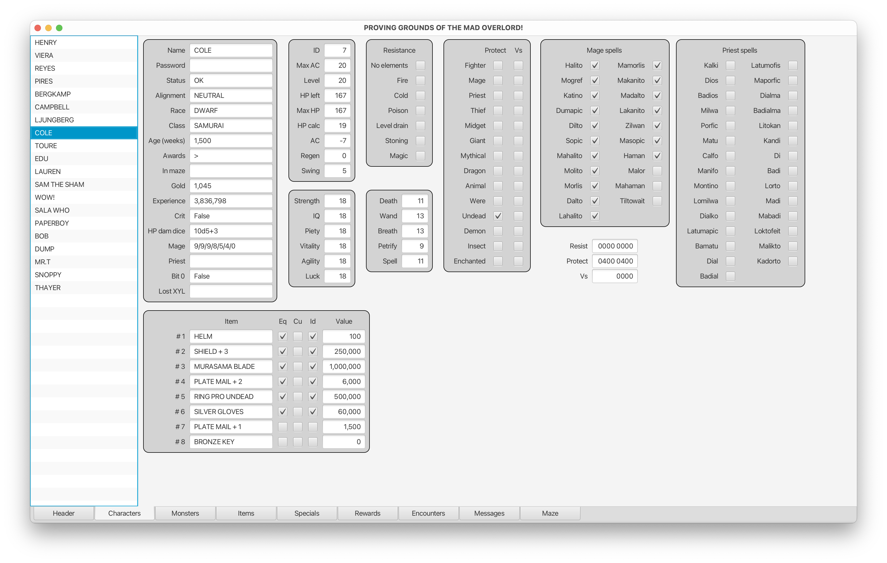
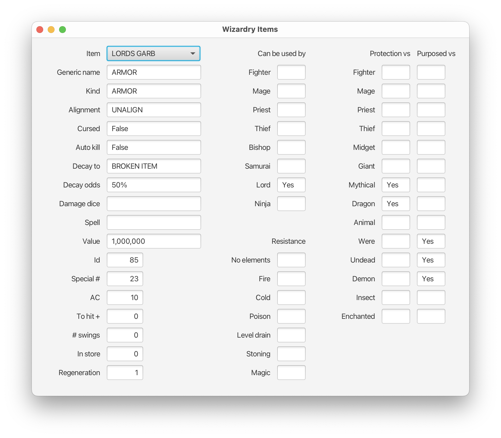
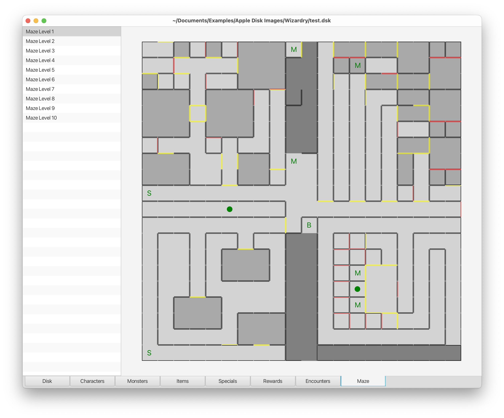

# WizardryApp
Cross-platform utility to examine Wizardry disk images. Currently works on the first three scenarios.

## Instructions
Use the File menu to open an existing Wizardry Scenario disk image. Select a tab to display the various Wizardry components

## Screens
### Characters


### Monsters


### Items


### Specials


### Rewards


### Encounters


### Messages


### Mazes
Navigate around the maze using the A/W/S/D keys. To go directly to a particular square, just click on it. There is no need to kick doors down, you can simply walk through any wall. None of the special squares affect you, and you can see perfectly well in the dark. You are invincible.


## Installation
- Download and install the latest [JDK](https://www.oracle.com/java/technologies/downloads/) and [JavaFX](https://gluonhq.com/products/javafx/) binaries.
- Download [WizardryApp](https://github.com/dmolony/WizardryApp/releases).
- Create executable run file as follows:  

#### MacOS or Linux shell file  

```
/path/to/jdk/Contents/Home/bin/java               \
--module-path /path/to/javafx-sdk/lib             \
--add-modules=javafx.controls                     \
-jar /path/to/WizardryApp.jar
```  

#### Windows batch file  

```
C:\path\to\jdk\bin\java.exe                       \
--module-path C:\path\to\javafx-sdk\lib           \
--add-modules=javafx.controls                     \
-jar C:\path\to\WizardryApp.jar
```

#### Hints
The first line in each of the above shell files can usually be shortened to 'java   \\' as it's just the command to execute java on your system. The second line must be the path to wherever you placed the javafx download.

## Wizardry 4
There is limited support for the fourth scenario.

