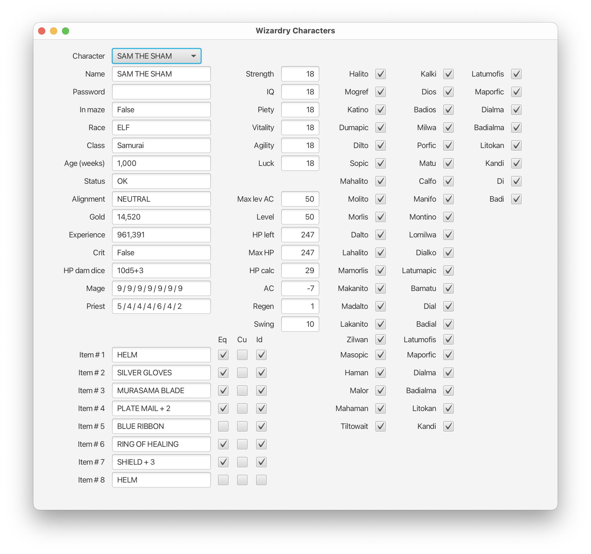
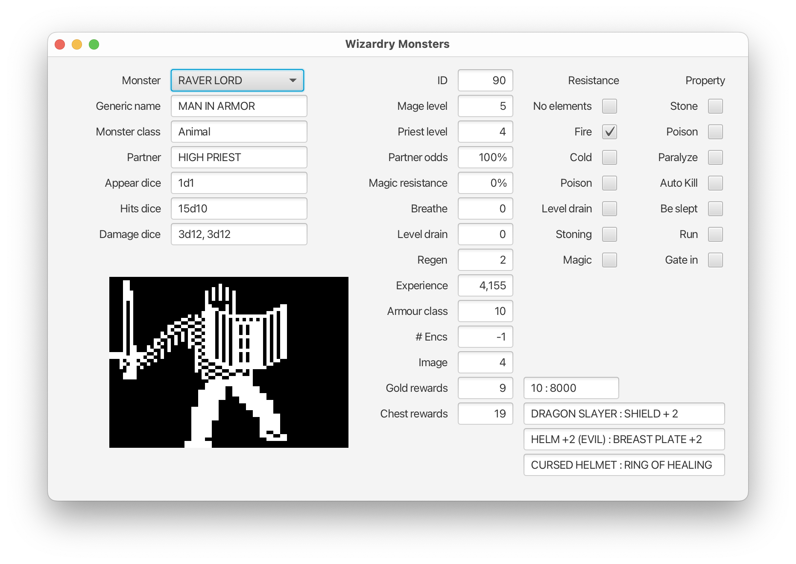
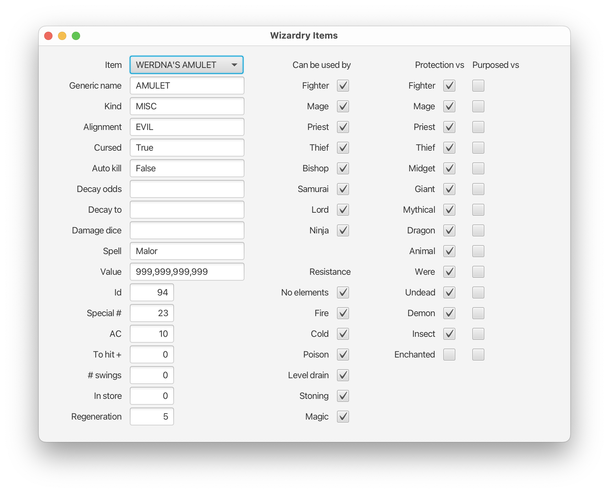
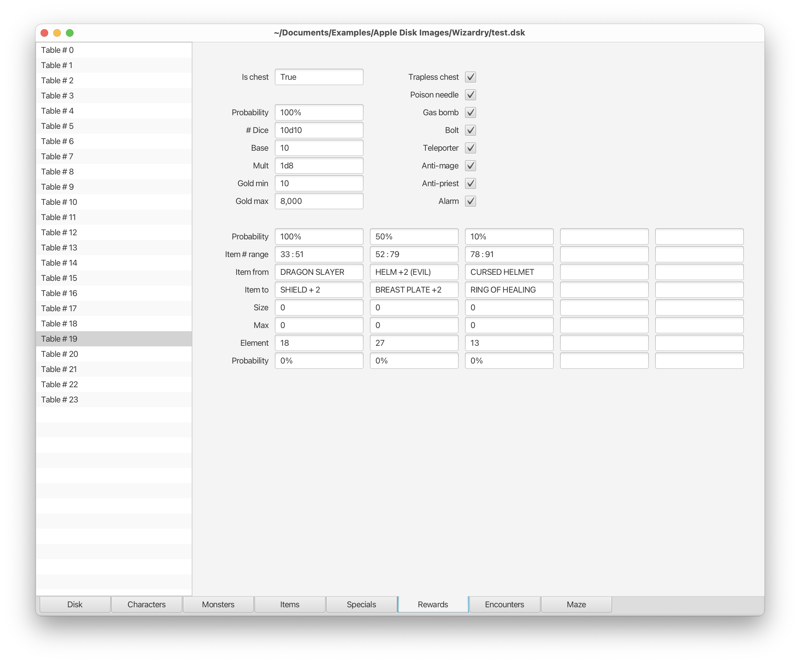
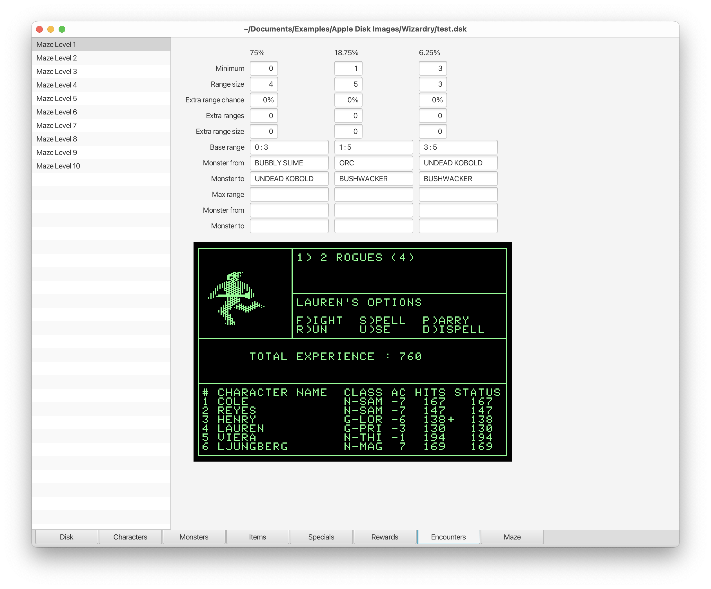
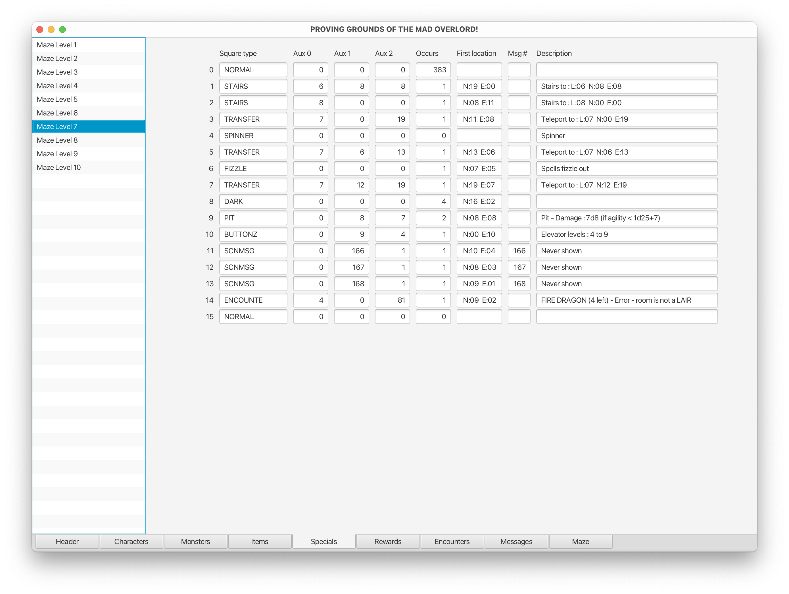
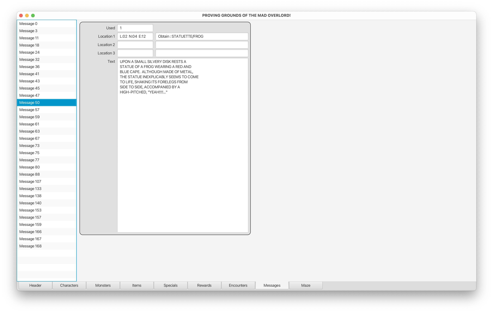
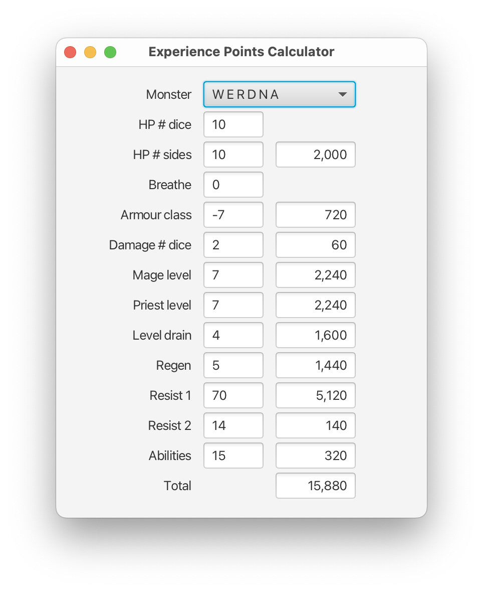
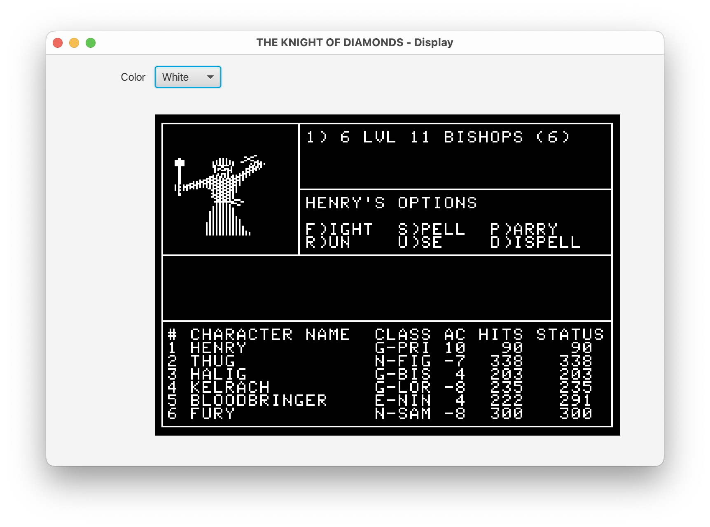

# MazeWalker
Utility to examine Wizardry mazes. Currently works on the first three scenarios.

## Instructions
Navigate around the maze using the A/W/S/D keys. To go directly to a particular square, just click on it. To switch to a different maze level, use the Levels menu (or the corresponding shortcut).
There is no need to kick doors down, you can simply walk through any wall. None of the special squares affect you, and you can see perfectly well in the dark. You are invincible.

## Screens












## Installation
- Download and install [Java 18](https://jdk.java.net/18/) and [JavaFX 18](https://gluonhq.com/products/javafx/).
- Download [MazeWalker](https://github.com/dmolony/MazeWalker/releases).
- Create executable run file.  
#### MacOS or Linux shell file  

```
/path/to/jdk-18.jdk/Contents/Home/bin/java        \
--module-path /path/to/javafx-sdk-18/lib          \
--add-modules=javafx.controls                     \
-jar /path/to/MazeWalker.jar
```  
#### Windows batch file  

```
C:\path\to\jdk-18\bin\java.exe                    \
--module-path C:\path\to\javafx-sdk-18\lib        \
--add-modules=javafx.controls                     \
-jar C:\path\to\MazeWalker.jar
```

#### Hints
The first line in each of the above shell files can usually be shortened to 'java   \\' as it's just the command to execute java on your system. The second line must be the path to wherever you placed the javafx download.
